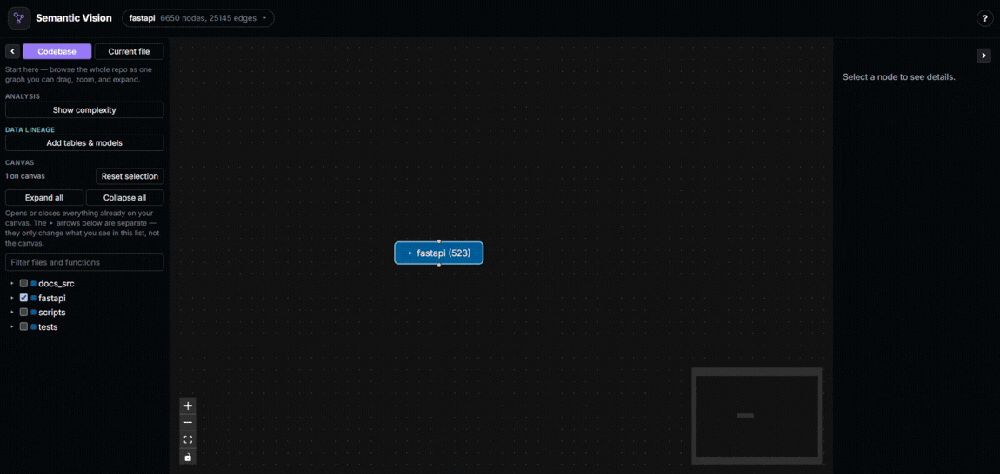
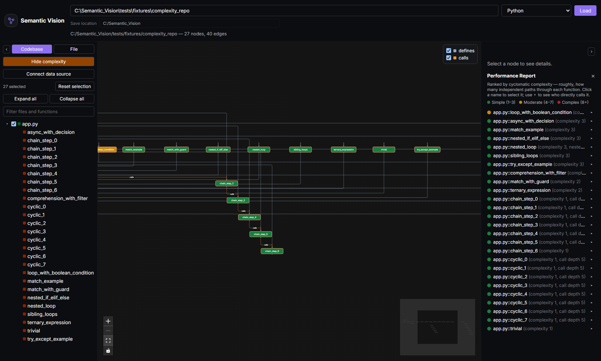

# Semantic Vision

**Understand any Python, JavaScript, or TypeScript codebase in minutes, not days.**


### What problem does this solve?

Engineers lose real hours every week reconstructing context on code
they didn't write — tracing callers by hand, guessing at blast radius,
reading files one at a time with no map of the whole. Documentation is
supposed to fill that gap, but it's the first thing that goes stale:
tedious to write, easy to skip, and quickly out of sync with code that
keeps changing. Semantic Vision builds that map automatically and
generates documentation on demand from the code as it actually is
today — nothing to remember to update, because nothing was hand-written
to begin with.

### At a glance

 Interactive call graph ·  Impact analysis ·  Execution flowcharts ·  Complexity report ·  AI-generated docs ·  Code-to-data lineage ·  100% local & private

##  Interactive Call Graph

Parsing is purely static (your code is never executed), and nothing
about it leaves your computer unless you explicitly ask for AI docs.




##  AI documentation setup

Right-click any function and choose **Document** to generate Markdown
docs for it, assembled from its real source, callers, callees, and
parent class — not just the function in isolation. Right-click a file
instead and the same action generates a module-level summary from its
imports and the signatures of everything it defines, without ever
sending a function body:


Pick a provider in the panel that opens — no extra setup is required to
try it, but each provider needs one of the following before generation
will work:

- **Ollama** (local, free, private) — install [Ollama](https://ollama.com),
  run `ollama serve`, and pull one or more models, e.g.
  `ollama pull llama3.2:3b`. The panel lists whatever you've actually
  pulled and lets you pick which one to use per generation — handy for
  swapping in a lighter model for quick testing. The backend talks to
  Ollama at `http://localhost:11434` by default.
- **OpenAI** — set an `OPENAI_API_KEY` environment variable before
  starting the backend. Uses `gpt-4o-mini` by default.
- **Anthropic** — set an `ANTHROPIC_API_KEY` environment variable before
  starting the backend. Uses `claude-haiku-4-5` by default.

OpenAI's and Anthropic's default model names can be overridden with
`SEMANTIC_VISION_OPENAI_MODEL` / `SEMANTIC_VISION_ANTHROPIC_MODEL`; for
Ollama, use the model picker in the panel instead. Generated docs are
only written to disk when you click **Save** — nothing is persisted
automatically, and they're written to wherever you've configured as
the **Save location** (see Quick start below).

##  Execution flowcharts

Right-click any function and choose **Execution Flowchart** to see
exactly how it behaves, built from its real AST/CST rather than a rough
summary: entry and return points, decisions with **Yes**/**No** edges,
loops with a visible back-edge, I/O calls, and calls out to other
functions in the repo — each in its own conventional flowchart shape.
Works for both Python and JS/TS, including `switch` fallthrough,
`do...while`'s bottom-condition check, and labeled `break`/`continue`.


The flowchart replaces the graph canvas while open; **Back to graph**
returns you to the normal call graph.

##  Complexity report

Toggle **Show complexity** in the sidebar to see a cyclomatic-complexity
heatmap over the whole graph and a ranked report of every function,
computed from a real AST walk — decisions, boolean-operator chains,
comprehension filters, `match` cases, and nested-loop hotspots all
count, not just a line-count guess.



Click any entry to jump to it on the graph; the ▸ drill-down shows its
direct callers (cross-referenced with their own scores), so you can
tell a complex-but-unused function apart from a complex one half the
codebase actually depends on.

##  Code-to-data lineage

The sidebar's **Data lineage** section extends the graph past your code
and into the data it reads and writes. Three sources feed the same
graph, reconciled by table name so the same table only ever shows up
once no matter how many of them see it:

- **SQLAlchemy models** — declarative model classes are detected
  automatically on every parse, no setup needed: each becomes a table
  node with its own columns underneath (expand the table to see them),
  foreign keys drawn as edges between tables, and every function that
  queries or writes one connected to it — down to the specific column,
  where it can be named with no guessing (a constructor's own keyword
  arguments, or a raw `INSERT`/`UPDATE`'s column list).
- **dbt** — click **Add tables & models** and paste the path to a
  `manifest.json` your own `dbt compile` already produced (Semantic
  Vision never invokes dbt itself) to pull in every model, its `ref()`
  dependencies, the table it materializes, and every column it declares.
- **A live database** — from the same panel, paste a read-only
  connection string to introspect a real schema directly — the highest-
  confidence column source there is, straight from the catalog — so you
  can see where your ORM models have drifted from what's actually
  deployed.


### Using it well

Once at least one table or dbt model is on the graph, two more tools in
the same **Data lineage** section turn "the graph happens to include
some tables" into an actual lineage view:

- **Data only** dims everything on the canvas that isn't a table, a
  dbt model, or code that directly reads/writes one — the same graph
  and the same impact analysis, just filtered to a lineage-only
  reading, rather than a separate mode you have to switch into and out
  of.
- **Impact analysis** works on a table — or a single column — node
  exactly like it does on a function: right-click it to see every
  function, model, and table upstream of it, code and data lineage in
  one traversal — the way to answer "what actually breaks if I rename
  this column, drop this table, or change what this dbt model
  materializes" before doing it, not after.

A real, worked example — dbt Labs' own `jaffle_shop` tutorial project
ingested into an app that already declares `Customer`/`Order` models
for the same tables, columns reconciling from both sources onto one
table, impact analysis crossing the dbt model, the ORM class, and the
reading functions in one right-click — is in
[guides/data-lineage.md](guides/data-lineage.md), with screenshots.

## ✨ Features

 **See the whole call graph at a glance** — every directory, file,
class, and function as a zoomable, color-coded graph with
call/import/defines edges. Structure that would take an hour of
grepping to piece together by hand is visible on one screen.

🔍 **Find anything instantly** — real-time search across the whole
repo, or scope the graph down to a single file's own structure when you
only care about a slice.

 **Know what you'll break before you break it** — right-click any
function for impact analysis: every direct and transitive caller,
circular call chains flagged instead of silently mishandled, and the
whole chain highlighted live on the graph.

 **Trace exactly how a function behaves** — right-click any function
for its execution flowchart: branches, loops with visible back-edges,
I/O, and calls out to other functions in the repo, rendered with
conventional flowchart shapes instead of you stepping through the code
by hand.

 **See which functions are worth worrying about** — a complexity
heatmap and ranked report across the whole repo, with a one-click
drill-down into who actually depends on each risky function.

 **Never write another docstring by hand** — right-click any function
to generate real Markdown documentation (Purpose, Parameters, Returns,
Side Effects, Notes) from its actual source, callers, callees, and
parent class, streamed live from your choice of a local
[Ollama](https://ollama.com) model, OpenAI, or Anthropic, and saved
straight into the repo.

 **See where your code touches your data — down to the column** —
SQLAlchemy models are detected automatically; connect a dbt manifest
and/or a live database to add their tables, models, and columns to the
same graph, reconciled by name. Flip **Data only** to read it as a pure
lineage diagram, with impact analysis spanning code and data in one
traversal.

💾 **Pick up exactly where you left off** — dragged layout, saved docs,
and analysis state persist locally and restore instantly next time you
open the same repo. The save location defaults to the repo's `.git`
root — auto-detected even if you've scoped the graph down to a
subfolder for performance — and can be changed at any time.

 **Fast, local, and private** — a FastAPI backend statically parses
your code (Python's own `ast` module for Python, [`tree-sitter`](https://tree-sitter.github.io/tree-sitter/)
for JavaScript/TypeScript), a React frontend renders it. No account, no
cloud, no telemetry, nothing installed beyond a Python and a Node
toolchain you already have.

## 📊 Status

What works today, per language:

| Feature | Python | JavaScript / TypeScript |
|---|:---:|:---:|
| Call graph — imports, classes, functions, calls | ✅ | ✅ |
| Interactive graph visualization | ✅ | ✅ |
| Search | ✅ | ✅ |
| Persisted layout & view state | ✅ | ✅ |
| Impact analysis (upstream callers, cycle detection) | ✅ | ✅ |
| Complexity report | ✅ | ✅ |
| AI-generated documentation | ✅ | ✅ |
| Execution flowcharts | ✅ | ✅ |
| Code-to-data lineage (SQLAlchemy, dbt, live DB) | ✅ | — |
| Docker packaging / one-command setup | ✅ | ✅ |


Select Python or JavaScript / TypeScript in the language selector to set the parsing scope. 

JS/TS uses tree-sitter for static AST resolution—including full support for JSX/TSX. To preserve precision without execution, dynamic patterns (like computed require() calls) are flagged directly in the UI rather than inferred.

## ⏱️ Benchmarks

Real-world numbers against genuinely large, well-known open-source repos — not this project's own
fixtures — one per supported language:

| Language | Repo | Files | Backend parse — cold (s) | Backend parse — warm (s) | Browser: time to render (s) |
|---|---|---|---|---|---|
| Python | [fastapi/fastapi](benchmarks/fastapi.md) | 1,138 | 23.25 | 4.08 | 7.20–7.84 |
| JavaScript | [three.js](benchmarks/threejs.md) | 752 | 29.33 | 1.98 | 4.88–5.01 |
| TypeScript | [nestjs/nest](benchmarks/nest.md) | 1,907 | 39.68 | 2.48 | 6.85–6.88 |

*"Cold" is the first read of a fresh clone this machine has never touched; "warm" is a second parse
of the identical files immediately after — the only variable that changes is OS file-cache state.
Every language shows a large cold/warm gap (5.7x–16x); it isn't specific to any one parser or
language. Warm-to-warm, TypeScript actually parses faster than Python.*

See the [`benchmarks/`](benchmarks/README.md) folder for the full methodology, a webpack case
study on what happens when a repo's default view doesn't collapse much, and the reasoning behind
every number above.

## 🚀 Quick start

Requires Python 3.12+, [uv](https://docs.astral.sh/uv/), and Node.js 20+.

```bash
git clone https://github.com/venom21adi/Semantic_Vision.git
cd Semantic_Vision

# Backend — from the repo root
uv sync
uv run uvicorn semantic_vision.api.app:app --port 8000

# Frontend — in a second terminal, from frontend/
cd frontend
npm install
npm run dev
```

Then open `http://localhost:5173`, enter the absolute path to any local
repository, pick **Python** or **JavaScript / TypeScript** from the
language selector, and click **Load**.

By default, everything Semantic Vision saves (layout, impact analysis
state, generated docs) is written to a `.visualiser/` folder at the
repository's `.git` root — even if the path you loaded is a subfolder
scoped down for performance on a large repo. A **Save location** field
next to the repository path shows and lets you override this before or
after loading; the first time anything is saved, a notice names exactly
where it went, with an inline **Change** control to relocate future
saves without re-parsing.

## 🐳 Run with Docker

Requires Docker and Docker Compose.

```bash
git clone https://github.com/venom21adi/Semantic_Vision.git
cd Semantic_Vision
cp .env.example .env
docker compose up --build
```

Then open `http://localhost:5173` and type `/workspace/repo` as the
repository path — that's the fixed, in-container path a host repository
gets mounted at (see below), not a real path on your machine. With no
further setup, `docker compose up` mounts this project's own repo as a
ready-to-explore demo.

To inspect a different repository, set `REPO_PATH` in `.env` to its
absolute path on your host machine before starting, then keep typing
`/workspace/repo` (or a subfolder of it, e.g. `/workspace/repo/src`) into
the app — never your real host path, which the container can't see.
`.env` is also where you'd set `OPENAI_API_KEY`, `ANTHROPIC_API_KEY`, or
`OLLAMA_API_BASE` (an Ollama server running on your host is reachable
from the backend container at `http://host.docker.internal:11434` by
default — see `.env.example` for the full list).

The mounted repository is read-only, with one deliberate exception: a
separate writable mount at `/workspace/repo/.visualiser` (landing at
`.visualiser/` in the repo on your host, exactly where it would locally)
so saves still work without making the rest of your source writable
inside the container. Two things follow from that:

- The **Save location** "Change" control only works if pointed back at
  `/workspace/repo/.visualiser` — anywhere else fails with a permission
  error, since that's the only writable path inside the container.
- The default auto-detected save location only lands there if the
  mounted repository has its own `.git` at `/workspace/repo` itself
  (true for `REPO_PATH` pointing at a repo root, not a path with no
  `.git` anywhere in its own tree).

## 🧩 How it works

Semantic Vision has two parts:

- **Backend** (`src/semantic_vision/`) — a FastAPI service that walks a
  repository (Python's `ast` module, or `tree-sitter` for
  JavaScript/TypeScript, chosen per load), resolves imports and call
  sites into a graph of nodes and edges, and serves it over a small REST
  API. Parsing is purely static: your code is never executed. AI
  documentation is generated separately, on demand, via
  [LiteLLM](https://docs.litellm.ai/) against whichever provider you
  pick. For a function, only its own source, its direct callers/callees'
  signatures, and its parent class header are sent; for a file, only its
  path, imports, and the signatures of what it defines — never a
  function body or the whole repository. Code-to-data lineage extends the same graph with table,
  column, and dbt-model nodes, from SQLAlchemy models detected in your code, a dbt
  `manifest.json` you point it at, and/or a live database connection
  string — held in memory for that one request only, never logged or
  written to disk.
- **Frontend** (`frontend/`) — a React + TypeScript app that renders the
  graph with [`@xyflow/react`](https://reactflow.dev/) and `dagre`
  auto-layout, and persists your layout and saved analysis state in a
  `.visualiser/` folder inside the repo you're inspecting.

## 🛠️ Development

```bash
# Backend
uv sync
uv run pytest -q
uv run ruff check .

# Frontend (from frontend/)
npm install
npm run test -- --run
npm run dev
```

## 🤝 Contributing

Issues and pull requests are welcome. This project is early and moving
fast — for anything beyond a small fix, please open an issue first to
discuss the approach.

## 📄 License

MIT — see [LICENSE](LICENSE).
