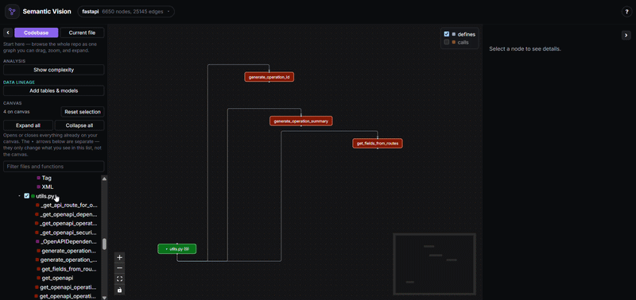
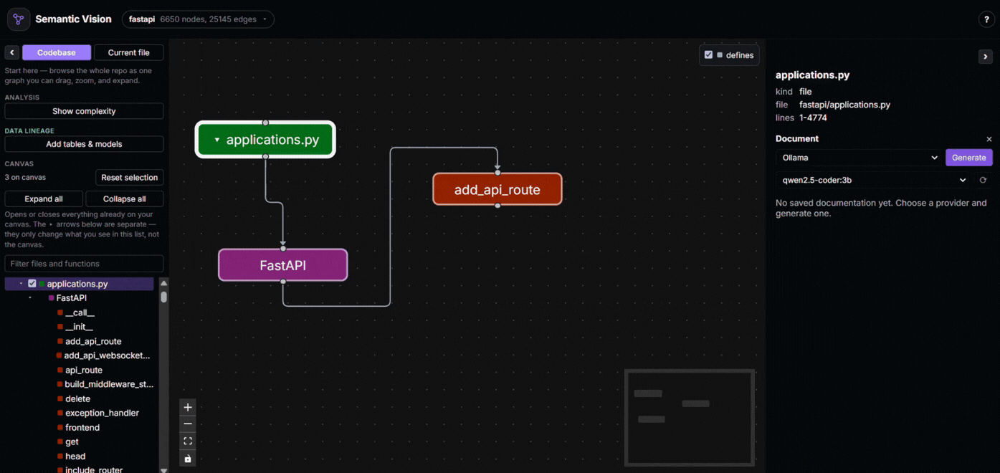
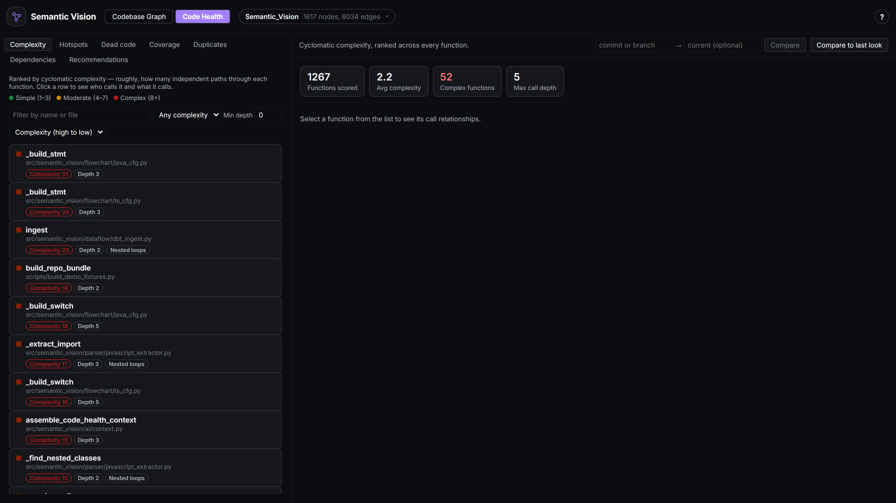
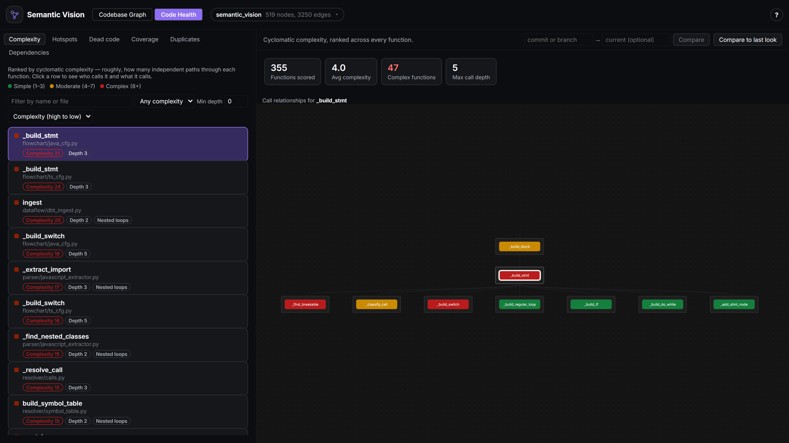
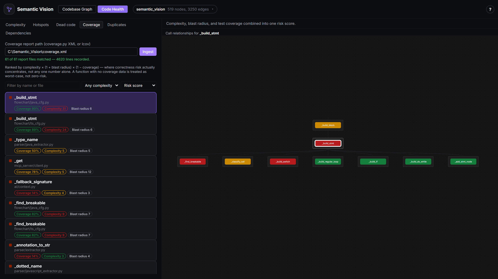
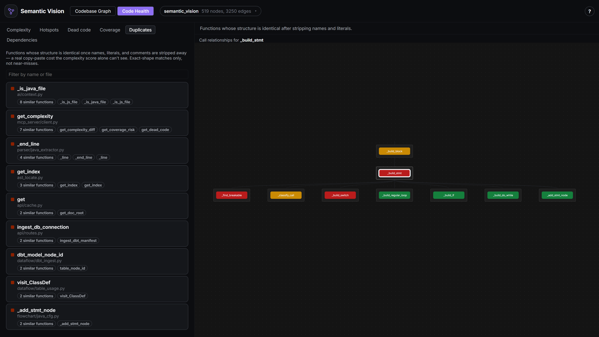
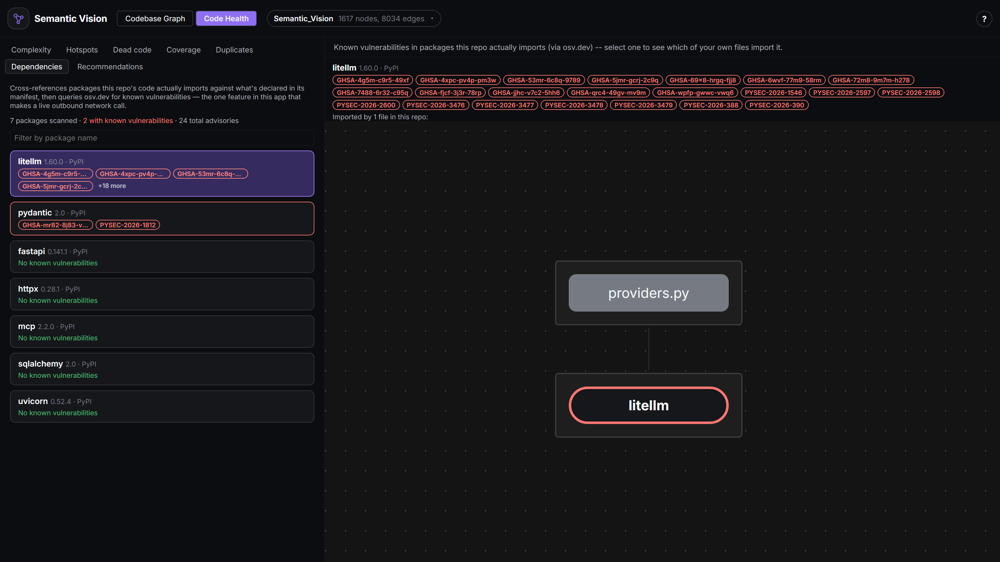
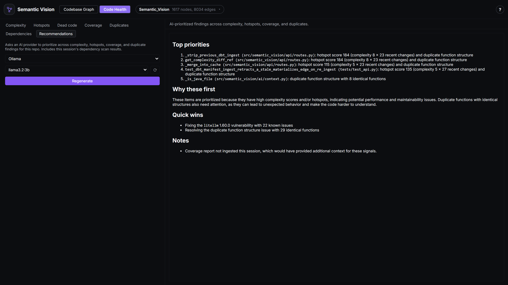

# Semantic Vision

**Codebase observability for you and your AI agents so you can use AI coding effectively and privately.**


[](https://marketplace.visualstudio.com/items?itemName=venom21adi.semantic-vision)

### What problem does this solve?

AI coding agents can now change large parts of a codebase in seconds. The problem is that our ability to understand those changes has not kept up.

A diff tells you what an agent changed not what depends on it, what it affects, or whether the codebase is actually getting better. Understanding that still means jumping between files, tracing dependencies, and relying on a mental model that is usually incomplete.

Semantic Vision gives you that context in one place so you can understand, review, and change a codebase with confidence, whether the last edit was yours or an agent's.

Impact Analysis shows the blast radius of any change. Call Graphs make relationships between files, classes, and functions visible. Execution Flowcharts show how a function actually behaves. Code Health surfaces complexity, hotspots, dead code, coverage, duplication, dependencies, and AI-powered recommendations. AI Documentation captures context from the code itself. Code-to-Data Lineage connects application logic to the tables and columns it depends on.

Everything runs locally 100% private. Your code never leaves your machine.

### At a glance

 Impact analysis ·  Interactive call graph ·  Execution flowcharts ·  Code Health ·  AI-generated docs ·  Code-to-data lineage · 🤖 MCP server for coding agents ·  100% local & private

##  Impact Analysis

Right-click any function — or, with code-to-data lineage connected, any
table or column — and choose **Impact Analysis** to see every direct
and transitive caller, resolved from the real call graph, not a guess.
Circular call chains are flagged instead of silently mishandled, and
the whole blast radius highlights live on the graph.



Reviewing an AI agent's edit, or your own? This is the answer to "what
actually depends on this" before you merge, not after something breaks
in production — the same traversal also crosses into data lineage, so
renaming a column or dropping a table surfaces every function, model,
and table upstream of it in one right-click.

##  Interactive Call Graph

Parsing is purely static (your code is never executed), and nothing
about it leaves your computer unless you explicitly ask for AI docs.


##  AI documentation setup

Right-click any function and choose **Document** to generate Markdown
docs for it, assembled from its real source, callers, callees, and
parent class — not just the function in isolation. Right-click a file
instead and the same action generates a module-level summary from its
imports and the signatures of everything it defines, without ever
sending a function body:



Pick a provider in the panel that opens — no extra setup is required to
try it, but each provider needs one of the following before generation
will work:

- **Ollama** (local, free, private) — install [Ollama](https://ollama.com),
  run `ollama serve`, and pull one or more models, e.g.
  `ollama pull llama3.2:3b`. The panel lists whatever you've actually
  pulled and lets you pick which one to use per generation — handy for
  swapping in a lighter model for quick testing. The backend talks to
  Ollama at `http://localhost:11434` by default.
- **OpenAI** — set an `OPENAI_API_KEY` environment variable before
  starting the backend. Uses `gpt-4o-mini` by default.
- **Anthropic** — set an `ANTHROPIC_API_KEY` environment variable before
  starting the backend. Uses `claude-haiku-4-5` by default.

OpenAI's and Anthropic's default model names can be overridden with
`SEMANTIC_VISION_OPENAI_MODEL` / `SEMANTIC_VISION_ANTHROPIC_MODEL`; for
Ollama, use the model picker in the panel instead. Generated docs are
only written to disk when you click **Save** — nothing is persisted
automatically, and they're written to wherever you've configured as
the **Save location** (see Quick start below).

##  Execution flowcharts

Right-click any function and choose **Execution Flowchart** to see
exactly how it behaves, built from its real AST/CST rather than a rough
summary: entry and return points, decisions with **Yes**/**No** edges,
loops with a visible back-edge, I/O calls, and calls out to other
functions in the repo — each in its own conventional flowchart shape.
Works for both Python and JS/TS, including `switch` fallthrough,
`do...while`'s bottom-condition check, and labeled `break`/`continue`.


The flowchart replaces the graph canvas while open; **Back to graph**
returns you to the normal call graph.

##  Code Health: score a change, not just a snapshot

**Code Health** sits in the header as a peer to **Codebase Graph** —
two persistent, browser-tab-style lenses on the same repo, not a panel
you open and close. Switching to it replaces the sidebar with a
filterable, sortable ranked list instead of leaving the graph's file
tree sitting there unused next to a second navigator. Seven tabs share
that list, each backed by its own `GET`/`POST /api/...` endpoint (see
[guides/mcp-server.md](guides/mcp-server.md) for the matching MCP tools)
— everything below runs locally against your own source, with two
explicit, opt-in exceptions noted below.



- **Complexity** (`GET /api/complexity`) — cyclomatic complexity for
  every function, computed from a real AST walk (decisions,
  boolean-operator chains, comprehension filters, `match` cases, and
  nested-loop hotspots all count, not just a line-count guess),
  filterable by name/file/tier/call depth and sortable by any of them.
- **Hotspots** (`GET /api/complexity/hotspots`) — the same complexity,
  weighted by how often each file actually changed in a chosen window —
  a moderately complex function edited constantly is a bigger practical
  risk than a complex one nobody touches.
- **Dead code** (`GET /api/dead-code`) — zero-caller functions after
  excluding decorators, test files, dunders, and entry points —
  candidates to review, never a verdict, since a caller outside the repo
  (a library's public API) can still be real.

Click any row to see exactly who calls it and what it calls, live:



Complexity is also git-aware: **Compare to last look** diffs the
current state against whatever it showed the last time you opened it
(useful right after an AI agent's session, or your own edit); typing a
commit or branch into the ref picker instead diffs against any point in
the repo's history — or fill in the second, optional field to diff two
arbitrary commits against each other, with no dependency on what's
currently checked out. Either way, the result is added / removed /
changed functions, each with its before-and-after complexity, so
"did this change make the code healthier or worse" is a glance instead
of a manual `git diff` read-through.

### Coverage — where correctness risk actually concentrates

Complexity and blast radius each answer half of "is this risky to
change"; neither alone answers "and is it actually tested." Point the
**Coverage** tab at a coverage.py XML (`coverage xml`) or lcov report
your own test-runner already produced (`POST /api/coverage/ingest` —
Semantic Vision never runs your tests itself, only reads what you
already generated), and every function gets ranked by `complexity ×
(1 + blast radius) × (1 − coverage)`:



A function with no coverage data at all badges **No coverage data** —
kept visually distinct from a genuinely-measured **Coverage 0%**, since
the risk formula treats both as worst-case but only one of them is
really "measured and bad."

### Duplicates — the maintenance cost complexity can't see

Two individually "simple" functions can still be a real duplication
cost together. The **Duplicates** tab (`GET /api/duplicates`) normalizes
every function's AST down to its bare shape — every identifier name,
literal value, and comment stripped away — and groups whatever hashes
identically:



Exact-shape matches only, not near-misses: a renamed-and-recommented
copy still groups with its original, but two functions with any real
structural difference won't. Click a group to jump to its first
member's own relationship graph, same as any other tab.

### Dependencies — the one feature that leaves your machine

Every import the resolver can't match inside your repo already becomes
a synthetic `external::` node; the **Dependencies** tab cross-references
those against what your manifest (`pyproject.toml` / `requirements.txt`
/ `package.json`) actually declares — only packages that are *both*
imported *and* declared get checked — then queries
[osv.dev](https://osv.dev) for known vulnerabilities against each. This
is the one outbound network call anywhere in Semantic Vision besides an
AI-provider doc request, so it's opt-in every time: check the consent
box, click **Scan dependencies**, and only then does anything leave your
machine (`POST /api/dependencies/risk` itself rejects the request
server-side if you didn't explicitly confirm, regardless of what any
client sends). Results render as a grid, sorted vulnerable-first — click
a package to see, in the same relationship-graph panel every other tab
uses, exactly which of *your own* files actually import it, not just
that it's declared somewhere:



### Recommendations — one AI pass across every signal above

Every tab above answers one question in isolation. **Recommendations**
asks an AI provider (the same local-[Ollama](https://ollama.com)/OpenAI/
Anthropic choice AI docs already use) to read the real complexity,
hotspot, coverage, and duplicate findings for your repo together and
prioritize — a function that's both a hotspot *and* part of a duplicate
group is a stronger signal than either fact alone, the kind of
correlation that's easy to miss skimming five separate ranked lists one
at a time. Dependency findings are folded in automatically once you've
scanned this session, but generating a recommendation never triggers
that scan itself — the osv.dev call stays exactly as opt-in as it is on
its own tab; clicking Generate here only ever talks to your chosen AI
provider, the same one AI docs already talk to.



##  Code-to-data lineage

The sidebar's **Data lineage** section extends the graph past your code
and into the data it reads and writes. Three sources feed the same
graph, reconciled by table name so the same table only ever shows up
once no matter how many of them see it:

- **SQLAlchemy models** — declarative model classes are detected
  automatically on every parse, no setup needed: each becomes a table
  node with its own columns underneath (expand the table to see them),
  foreign keys drawn as edges between tables, and every function that
  queries or writes one connected to it — down to the specific column,
  where it can be named with no guessing (a constructor's own keyword
  arguments, or a raw `INSERT`/`UPDATE`'s column list).
- **dbt** — click **Add tables & models** and paste the path to a
  `manifest.json` your own `dbt compile` already produced (Semantic
  Vision never invokes dbt itself) to pull in every model, its `ref()`
  dependencies, the table it materializes, and every column it declares.
- **A live database** — from the same panel, paste a read-only
  connection string to introspect a real schema directly — the highest-
  confidence column source there is, straight from the catalog — so you
  can see where your ORM models have drifted from what's actually
  deployed.


### Using it well

Once at least one table or dbt model is on the graph, two more tools in
the same **Data lineage** section turn "the graph happens to include
some tables" into an actual lineage view:

- **Data only** dims everything on the canvas that isn't a table, a
  dbt model, or code that directly reads/writes one — the same graph
  and the same impact analysis, just filtered to a lineage-only
  reading, rather than a separate mode you have to switch into and out
  of.
- **Impact analysis** works on a table — or a single column — node
  exactly like it does on a function: right-click it to see every
  function, model, and table upstream of it, code and data lineage in
  one traversal — the way to answer "what actually breaks if I rename
  this column, drop this table, or change what this dbt model
  materializes" before doing it, not after.

A real, worked example — dbt Labs' own `jaffle_shop` tutorial project
ingested into an app that already declares `Customer`/`Order` models
for the same tables, columns reconciling from both sources onto one
table, impact analysis crossing the dbt model, the ORM class, and the
reading functions in one right-click — is in
[guides/data-lineage.md](guides/data-lineage.md), with screenshots.

## 🤖 MCP server for coding agents

Semantic Vision already computes the exact structural facts a coding agent
otherwise has to grep and guess at — call graph, impact analysis, complexity,
git-aware hotspot scoring, and data lineage. `semantic-vision-mcp` exposes
all of it as [MCP](https://modelcontextprotocol.io) tools any compatible
agent (Claude Code, Claude Desktop, Cursor, etc.) can call mid-conversation:

```bash
uv sync
uv run semantic-vision-mcp
```

then add it to your agent as a stdio MCP server, e.g. for Claude Code:

```bash
claude mcp add semantic-vision -- uv --directory /path/to/Semantic_Vision run semantic-vision-mcp
```

It talks to the same FastAPI backend over HTTP rather than running a
separate analysis engine — reachable-or-spawn, exactly like the VS Code
extension: if you already have the desktop app or extension open with a repo
parsed, the MCP server reuses that warm cache instead of starting cold; if
nothing's running, it spawns its own backend and cleans it up on exit.
`parse_repo`, `get_graph`, `get_impact`, `get_callees`, `get_complexity`,
`get_complexity_diff`(`_ref`), `get_hotspots`, `get_dead_code`,
`ingest_coverage`, `get_coverage_risk`, `get_duplicates`, `get_git_refs`,
`get_flowchart`, and `get_function_source` cover the same ground the UI
does — see [guides/mcp-server.md](guides/mcp-server.md) for the full tool
reference, client config examples, and what's deliberately left out: both
dependency/security-risk scanning and AI-generated Recommendations stay
web-app-only, since neither an outbound network call nor client-supplied
scan data an agent didn't ask for is something a tool call should trigger
silently.


## ✨ Features

 **See the whole call graph at a glance** — every directory, file,
class, and function as a zoomable, color-coded graph with
call/import/defines edges. Structure that would take an hour of
grepping to piece together by hand is visible on one screen.

🔍 **Find anything instantly** — real-time search across the whole
repo, or scope the graph down to a single file's own structure when you
only care about a slice.

 **Know what you'll break before you break it** — right-click any
function for impact analysis: every direct and transitive caller,
circular call chains flagged instead of silently mishandled, and the
whole chain highlighted live on the graph.

 **Trace exactly how a function behaves** — right-click any function
for its execution flowchart: branches, loops with visible back-edges,
I/O, and calls out to other functions in the repo, rendered with
conventional flowchart shapes instead of you stepping through the code
by hand.

 **See which functions are worth worrying about** — the Code Health
lens ranks every function by complexity, by hotspot score (complexity ×
how often it actually changes), by coverage-vs-blast-radius risk, lists
dead-code and near-duplicate candidates, and flags known vulnerabilities
in packages you actually import — click a vulnerable package to see
exactly which of your own files import it; click any function to see
exactly who calls it and what it calls, live. An AI pass across all of
it then prioritizes what to actually work on first, correlating signals
a person skimming five ranked lists one at a time would likely miss.

 **Judge a change, not just a snapshot** — Code Health compares
complexity against the last time you looked, any commit or branch, or
two arbitrary commits against each other, so "did this AI agent's edit
help or hurt" is a glance instead of a manual diff read.

 **Never write another docstring by hand** — right-click any function
to generate real Markdown documentation (Purpose, Parameters, Returns,
Side Effects, Notes) from its actual source, callers, callees, and
parent class, streamed live from your choice of a local
[Ollama](https://ollama.com) model, OpenAI, or Anthropic, and saved
straight into the repo.

 **See where your code touches your data — down to the column** —
SQLAlchemy models are detected automatically; connect a dbt manifest
and/or a live database to add their tables, models, and columns to the
same graph, reconciled by name. Flip **Data only** to read it as a pure
lineage diagram, with impact analysis spanning code and data in one
traversal.

🤖 **Give a coding agent the same map** — an [MCP](https://modelcontextprotocol.io)
server exposes the call graph, impact analysis, complexity/hotspot
scoring, and data lineage as tools Claude Code, Claude Desktop, or any
other MCP-compatible agent can call directly, instead of grepping and
guessing at blast radius. Reuses whatever backend and cache you already
have running — no separate setup, no re-parsing.

🧩 **Right inside your editor, zero setup** — install the
[VS Code extension](https://marketplace.visualstudio.com/items?itemName=venom21adi.semantic-vision)
and get the full graph, impact analysis, and everything else below in a
panel next to your code — no separate browser tab, no Python or `uv` to
install, the backend ships bundled in.

💾 **Pick up exactly where you left off** — dragged layout, saved docs,
and analysis state persist locally and restore instantly next time you
open the same repo. The save location defaults to the repo's `.git`
root — auto-detected even if you've scoped the graph down to a
subfolder for performance — and can be changed at any time.

 **Fast, local, and private** — a FastAPI backend statically parses
your code (Python's own `ast` module for Python, [`tree-sitter`](https://tree-sitter.github.io/tree-sitter/)
for JavaScript/TypeScript and Java), a React frontend renders it. No account, no
cloud, no telemetry, nothing installed beyond a Python and a Node
toolchain you already have.

## 📊 Status

What works today, per language:

| Feature | Python | JavaScript / TypeScript | Java |
|---|:---:|:---:|:---:|
| Call graph — imports, classes, functions, calls | ✅ | ✅ | ✅ |
| Interactive graph visualization | ✅ | ✅ | ✅ |
| Search | ✅ | ✅ | ✅ |
| Persisted layout & view state | ✅ | ✅ | ✅ |
| Impact analysis (upstream callers, cycle detection) | ✅ | ✅ | ✅ |
| Code Health (complexity, hotspots, dead code, coverage, duplicates, dependencies, AI recommendations) | ✅ | ✅ | ✅ |
| AI-generated documentation | ✅ | ✅ | ✅ |
| Execution flowcharts | ✅ | ✅ | ✅ |
| Code-to-data lineage (SQLAlchemy, dbt, live DB) | ✅ | — | — |
| Docker packaging / one-command setup | ✅ | ✅ | ✅ |

Most real repos are polyglot, so Semantic Vision auto-detects which supported languages are present in the path you enter and pre-checks them as chips — Python, JavaScript / TypeScript, and Java can all be selected together for the same repo. Each selected language is parsed independently and shown as its own tab in the dashboard (call graph, Code Health, docs, etc. all scoped to that language); there's no cross-language call linking between tabs yet.

JS/TS uses tree-sitter for static AST resolution—including full support for JSX/TSX. To preserve precision without execution, dynamic patterns (like computed require() calls) are flagged directly in the UI rather than inferred.

## ⏱️ Benchmarks

Real-world numbers against genuinely large, well-known open-source repos — not this project's own
fixtures — one per supported language:

| Language | Repo | Files | Backend parse — cold (s) | Backend parse — warm (s) | Browser: time to render (s) |
|---|---|---|---|---|---|
| Python | [fastapi/fastapi](benchmarks/fastapi.md) | 1,138 | 23.25 | 4.08 | 7.20–7.84 |
| JavaScript | [three.js](benchmarks/threejs.md) | 752 | 29.33 | 1.98 | 4.88–5.01 |
| TypeScript | [nestjs/nest](benchmarks/nest.md) | 1,907 | 39.68 | 2.48 | 6.85–6.88 |
| Java | [google/guava](benchmarks/guava.md) | 615 | 9.83 | 2.52 | 4.73–7.63 |

*"Cold" is the first read of a fresh clone this machine has never touched; "warm" is a second parse
of the identical files immediately after — the only variable that changes is OS file-cache state.
Every language shows a large cold/warm gap (3.9x–16x); it isn't specific to any one parser or
language. Warm-to-warm, TypeScript actually parses faster than Python, and Java is right alongside
it.*

See the [`benchmarks/`](benchmarks/README.md) folder for the full methodology, a webpack case
study on what happens when a repo's default view doesn't collapse much, and the reasoning behind
every number above.

## 🚀 Quick start

Requires Python 3.12+, [uv](https://docs.astral.sh/uv/), and Node.js 20+.

```bash
git clone https://github.com/venom21adi/Semantic_Vision.git
cd Semantic_Vision

# Backend — from the repo root
uv sync
uv run uvicorn semantic_vision.api.app:app --port 8000

# Frontend — in a second terminal, from frontend/
cd frontend
npm install
npm run dev
```

Then open `http://localhost:5173`, enter the absolute path to any local
repository. Detected languages (**Python**, **JavaScript / TypeScript**,
**Java**) are pre-checked as chips — adjust the selection if needed —
then click **Load**.

By default, everything Semantic Vision saves (layout, impact analysis
state, generated docs) is written to a `.visualiser/` folder at the
repository's `.git` root — even if the path you loaded is a subfolder
scoped down for performance on a large repo. A **Save location** field
next to the repository path shows and lets you override this before or
after loading; the first time anything is saved, a notice names exactly
where it went, with an inline **Change** control to relocate future
saves without re-parsing.

## 🐳 Run with Docker

Requires Docker and Docker Compose.

```bash
git clone https://github.com/venom21adi/Semantic_Vision.git
cd Semantic_Vision
cp .env.example .env      # Windows CMD: copy .env.example .env
docker compose up --build
```

Open `http://localhost:5173` — with no further setup, it mounts the
project's own repo, so `/workspace/repo` gets you a ready-to-explore
demo. To point it at one of your own repos, set `REPO_PATH` in `.env`
first:

```bash
# .env
REPO_PATH=C:/Users/you/projects/my-repo
```

then `docker compose up --build` and paste that same path (the real one
from your machine, not `/workspace/repo`) into the app's repository-path
field — it's mapped into the container automatically. Point `REPO_PATH`
at a *parent* folder instead of one repo to switch between several
without editing `.env` or restarting each time; see
[guides/docker-setup.md](guides/docker-setup.md) for that pattern, plus
the AI provider keys and where saved data lands.

`REPO_PATH` is deliberately a one-time `.env` setting, not something the
app can change about itself at runtime — see
["Why REPO_PATH isn't configurable from the app itself"](guides/docker-setup.md#why-repo_path-isnt-configurable-from-the-app-itself)
for why.

Loading a large repo for the first time is noticeably slower in Docker
than natively (bind-mounted files cross the Docker Desktop VM boundary on
every read) — every load after that first one is much faster, since the
backend keeps an internal fast copy and only re-reads what actually
changed. See ["Why the first load is slow"](guides/docker-setup.md#why-the-first-load-is-slow-and-why-every-load-after-that-isnt) for the numbers.


## 🧩 VS Code Extension

The fastest way to try Semantic Vision: install it straight from the
[VS Code Marketplace](https://marketplace.visualstudio.com/items?itemName=venom21adi.semantic-vision)
(search **Semantic Vision**, or `ext install venom21adi.semantic-vision`)
and open a Python, JavaScript/TypeScript, or Java repo — no Python, no
`uv`, nothing beyond VS Code itself. The backend it needs ships bundled
inside the extension for Windows, macOS (Intel and Apple Silicon), and
Linux.

- **Semantic Vision: Open Graph** — opens the same interactive graph as
  the web app in a panel beside your editor, centered on whichever file
  you have open. Click any node to jump straight to that code.
- **Semantic Vision: Impact Analysis at Cursor** (also on the editor's
  right-click menu) — resolves your cursor position to a graph node and
  highlights its full blast radius without leaving your place in the
  file.

Every other feature below — flowcharts, the complexity report, AI docs,
code-to-data lineage — works the same way inside that panel. See
[vscode-extension/README.md](vscode-extension/README.md) for
configuration details (e.g. pointing it at an already-running backend
instead of the bundled one). Prefer running the backend and frontend
yourself, or via Docker? Both remain fully supported below.

## 🧩 How it works

Semantic Vision has three parts:

- **Backend** (`src/semantic_vision/`) — a FastAPI service that walks a
  repository (Python's `ast` module, or `tree-sitter` for
  JavaScript/TypeScript and Java, chosen per load), resolves imports and
  call sites into a graph of nodes and edges, and serves it over a small
  REST API. Parsing is purely static: your code is never executed. AI
  documentation is generated separately, on demand, via
  [LiteLLM](https://docs.litellm.ai/) against whichever provider you
  pick. For a function, only its own source, its direct callers/callees'
  signatures, and its parent class header are sent; for a file, only its
  path, imports, and the signatures of what it defines — never a
  function body or the whole repository. Code-to-data lineage extends the same graph with table,
  column, and dbt-model nodes, from SQLAlchemy models detected in your code, a dbt
  `manifest.json` you point it at, and/or a live database connection
  string — held in memory for that one request only, never logged or
  written to disk.
- **Frontend** (`frontend/`) — a React + TypeScript app that renders the
  graph with [`@xyflow/react`](https://reactflow.dev/) and `dagre`
  auto-layout, and persists your layout and saved analysis state in a
  `.visualiser/` folder inside the repo you're inspecting.
- **MCP server** (`src/semantic_vision/mcp_server/`) — a thin wrapper
  exposing the backend's REST API as MCP tools over stdio for coding
  agents, described above; no analysis logic of its own.

## 🛠️ Development

```bash
# Backend
uv sync
uv run pytest -q
uv run ruff check .

# Frontend (from frontend/)
npm install
npm run test -- --run
npm run dev
```

## 🤝 Contributing

Issues and pull requests are welcome. This project is early and moving
fast — for anything beyond a small fix, please open an issue first to
discuss the approach.

## 📄 License

MIT — see [LICENSE](LICENSE).
