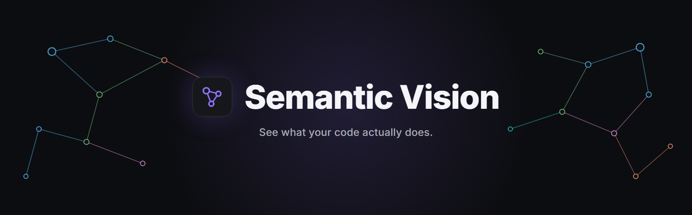
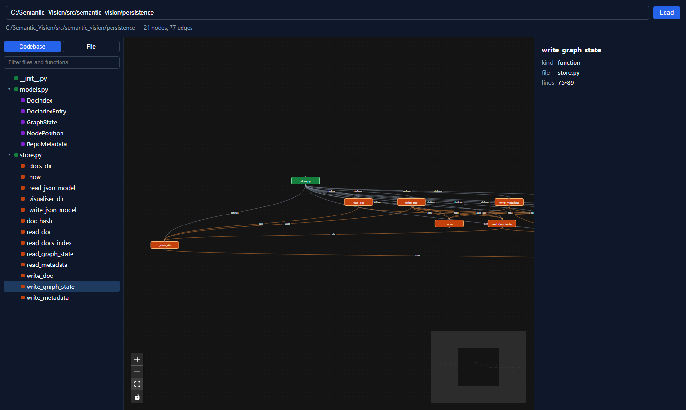
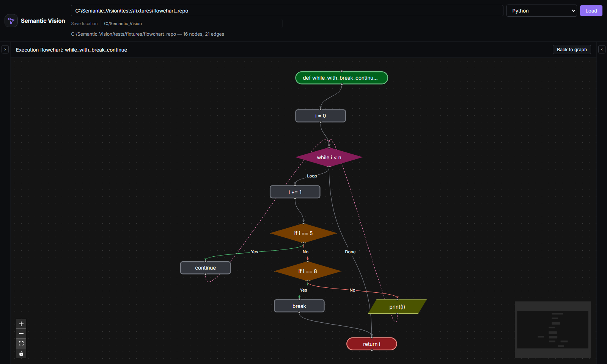

# Semantic Vision

**Understand any Python codebase in minutes, not days.**


**What problem does this solve?**

Engineers lose real hours every week reconstructing context on code
they didn't write — tracing callers by hand, guessing at blast radius,
reading files one at a time with no map of the whole. Documentation is
supposed to fill that gap, but it's the first thing that goes stale:
tedious to write, easy to skip, and quickly out of sync with code that
keeps changing. Semantic Vision builds that map automatically and
generates documentation on demand from the code as it actually is
today — nothing to remember to update, because nothing was hand-written
to begin with.

**At a glance:**

🕸️ Interactive call graph · 💥 Impact analysis · 🧭 Execution flowcharts · 📝 AI-generated docs · ⚡ 100% local & private

Parsing is purely static (your code is never executed), and nothing
about it leaves your computer unless you explicitly ask for AI docs.



## 🤖 AI documentation setup

Right-click any function and choose **Document** to generate Markdown
docs for it, assembled from its real source, callers, callees, and
parent class — not just the function in isolation:


Pick a provider in the panel that opens — no extra setup is required to
try it, but each provider needs one of the following before generation
will work:

- **Ollama** (local, free, private) — install [Ollama](https://ollama.com),
  run `ollama serve`, and pull one or more models, e.g.
  `ollama pull llama3.2:3b`. The panel lists whatever you've actually
  pulled and lets you pick which one to use per generation — handy for
  swapping in a lighter model for quick testing. The backend talks to
  Ollama at `http://localhost:11434` by default.
- **OpenAI** — set an `OPENAI_API_KEY` environment variable before
  starting the backend. Uses `gpt-4o-mini` by default.
- **Anthropic** — set an `ANTHROPIC_API_KEY` environment variable before
  starting the backend. Uses `claude-haiku-4-5` by default.

OpenAI's and Anthropic's default model names can be overridden with
`SEMANTIC_VISION_OPENAI_MODEL` / `SEMANTIC_VISION_ANTHROPIC_MODEL`; for
Ollama, use the model picker in the panel instead. Generated docs are
only written to disk when you click **Save** — nothing is persisted
automatically, and they're written to wherever you've configured as
the **Save location** (see Quick start below).

## 🧭 Execution flowcharts

Right-click any function and choose **Execution Flowchart** to see
exactly how it behaves, built from its real AST rather than a rough
summary: entry and return points, decisions with **Yes**/**No** edges,
loops with a visible back-edge, I/O calls, and calls out to other
functions in the repo — each in its own conventional flowchart shape.



The flowchart replaces the graph canvas while open; **Back to graph**
returns you to the normal call graph.

## ✨ Features

🕸️ **See the whole call graph at a glance** — every directory, file,
class, and function as a zoomable, color-coded graph with
call/import/defines edges. Structure that would take an hour of
grepping to piece together by hand is visible on one screen.

🔍 **Find anything instantly** — real-time search across the whole
repo, or scope the graph down to a single file's own structure when you
only care about a slice.

💥 **Know what you'll break before you break it** — right-click any
function for impact analysis: every direct and transitive caller,
circular call chains flagged instead of silently mishandled, and the
whole chain highlighted live on the graph.

🧭 **Trace exactly how a function behaves** — right-click any function
for its execution flowchart: branches, loops with visible back-edges,
I/O, and calls out to other functions in the repo, rendered with
conventional flowchart shapes instead of you stepping through the code
by hand.

📝 **Never write another docstring by hand** — right-click any function
to generate real Markdown documentation (Purpose, Parameters, Returns,
Side Effects, Notes) from its actual source, callers, callees, and
parent class, streamed live from your choice of a local
[Ollama](https://ollama.com) model, OpenAI, or Anthropic, and saved
straight into the repo.

💾 **Pick up exactly where you left off** — dragged layout, saved docs,
and analysis state persist locally and restore instantly next time you
open the same repo. The save location defaults to the repo's `.git`
root — auto-detected even if you've scoped the graph down to a
subfolder for performance — and can be changed at any time.

⚡ **Fast, local, and private** — a FastAPI backend statically parses
your code with Python's own `ast` module, a React frontend renders it.
No account, no cloud, no telemetry, nothing installed beyond a Python
and a Node toolchain you already have.

## 📊 Status

Semantic Vision is under active development. Here's what works today
and what's still ahead:

| Feature | Status |
|---|---|
| Codebase parsing — imports, classes, functions, call graph | ✅ Available |
| Interactive graph visualization | ✅ Available |
| Searchable file/function tree | ✅ Available |
| Persisted layout & view state | ✅ Available |
| Impact analysis (upstream callers, cycle detection) | ✅ Available |
| AI-generated function documentation | ✅ Available |
| Function-level execution flowcharts | ✅ Available |
| Docker packaging / one-command setup | ✅ Available |
| Multi-language support (beyond Python) | 🚧 Planned |

The parsing layer targets Python today; the graph, API, and persistence
layers are built to stay language-neutral so other languages can plug
in later.

## 🚀 Quick start

Requires Python 3.12+, [uv](https://docs.astral.sh/uv/), and Node.js 20+.

```bash
git clone https://github.com/venom21adi/Semantic_Vision.git
cd Semantic_Vision

# Backend — from the repo root
uv sync
uv run uvicorn semantic_vision.api.app:app --port 8000

# Frontend — in a second terminal, from frontend/
cd frontend
npm install
npm run dev
```

Then open `http://localhost:5173`, enter the absolute path to any local
Python repository, and click **Load**.

By default, everything Semantic Vision saves (layout, impact analysis
state, generated docs) is written to a `.visualiser/` folder at the
repository's `.git` root — even if the path you loaded is a subfolder
scoped down for performance on a large repo. A **Save location** field
next to the repository path shows and lets you override this before or
after loading; the first time anything is saved, a notice names exactly
where it went, with an inline **Change** control to relocate future
saves without re-parsing.

## 🐳 Run with Docker

Requires Docker and Docker Compose.

```bash
git clone https://github.com/venom21adi/Semantic_Vision.git
cd Semantic_Vision
cp .env.example .env
docker compose up --build
```

Then open `http://localhost:5173` and type `/workspace/repo` as the
repository path — that's the fixed, in-container path a host repository
gets mounted at (see below), not a real path on your machine. With no
further setup, `docker compose up` mounts this project's own repo as a
ready-to-explore demo.

To inspect a different repository, set `REPO_PATH` in `.env` to its
absolute path on your host machine before starting, then keep typing
`/workspace/repo` (or a subfolder of it, e.g. `/workspace/repo/src`) into
the app — never your real host path, which the container can't see.
`.env` is also where you'd set `OPENAI_API_KEY`, `ANTHROPIC_API_KEY`, or
`OLLAMA_API_BASE` (an Ollama server running on your host is reachable
from the backend container at `http://host.docker.internal:11434` by
default — see `.env.example` for the full list).

The mounted repository is read-only, with one deliberate exception: a
separate writable mount at `/workspace/repo/.visualiser` (landing at
`.visualiser/` in the repo on your host, exactly where it would locally)
so saves still work without making the rest of your source writable
inside the container. Two things follow from that:

- The **Save location** "Change" control only works if pointed back at
  `/workspace/repo/.visualiser` — anywhere else fails with a permission
  error, since that's the only writable path inside the container.
- The default auto-detected save location only lands there if the
  mounted repository has its own `.git` at `/workspace/repo` itself
  (true for `REPO_PATH` pointing at a repo root, not a path with no
  `.git` anywhere in its own tree).

## 🧩 How it works

Semantic Vision has two parts:

- **Backend** (`src/semantic_vision/`) — a FastAPI service that walks a
  repository with Python's `ast` module, resolves imports and call sites
  into a graph of nodes and edges, and serves it over a small REST API.
  Parsing is purely static: your code is never executed. AI
  documentation is generated separately, on demand, via
  [LiteLLM](https://docs.litellm.ai/) against whichever provider you
  pick — only the target function's source, its direct callers/callees'
  signatures, and its parent class header are sent, never the whole
  repository.
- **Frontend** (`frontend/`) — a React + TypeScript app that renders the
  graph with [`@xyflow/react`](https://reactflow.dev/) and `dagre`
  auto-layout, and persists your layout and saved analysis state in a
  `.visualiser/` folder inside the repo you're inspecting.

## 🛠️ Development

```bash
# Backend
uv sync
uv run pytest -q
uv run ruff check .

# Frontend (from frontend/)
npm install
npm run test -- --run
npm run dev
```

## 🤝 Contributing

Issues and pull requests are welcome. This project is early and moving
fast — for anything beyond a small fix, please open an issue first to
discuss the approach.

## 📄 License

MIT — see [LICENSE](LICENSE).
