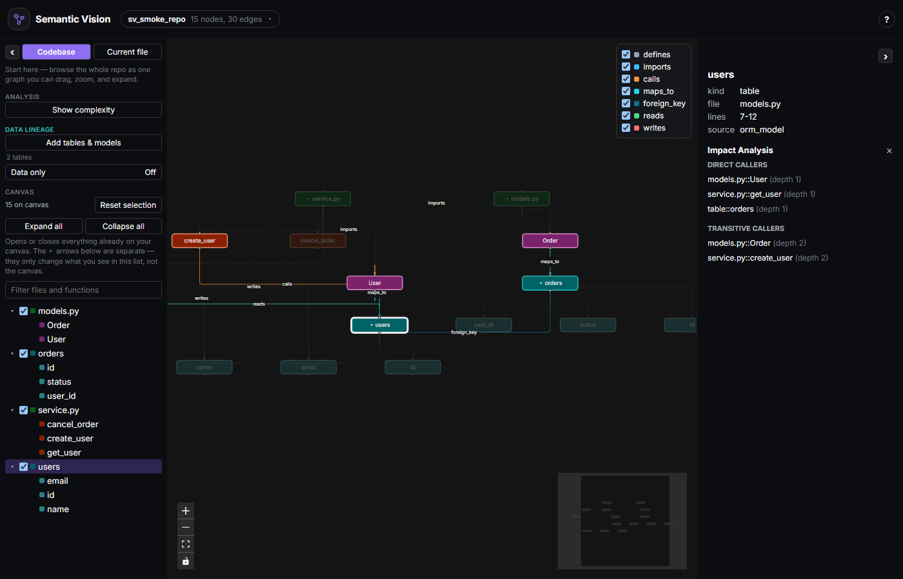
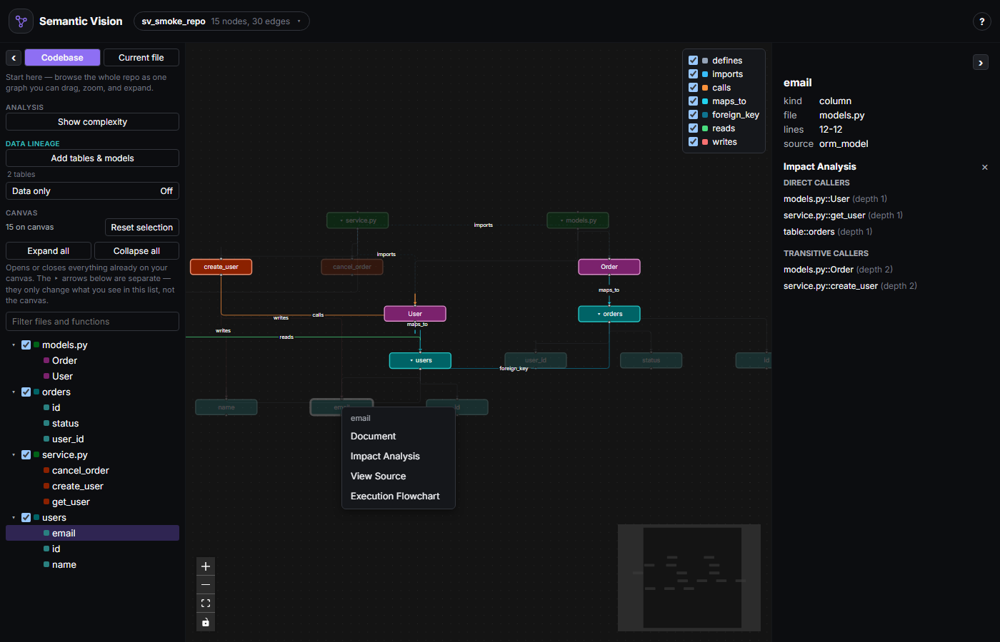
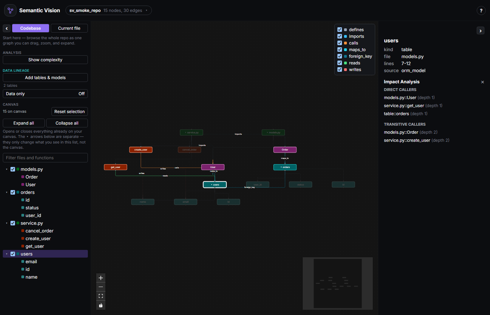
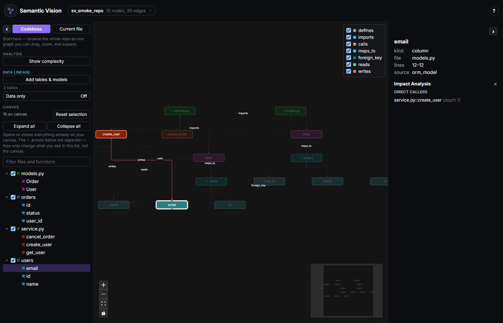
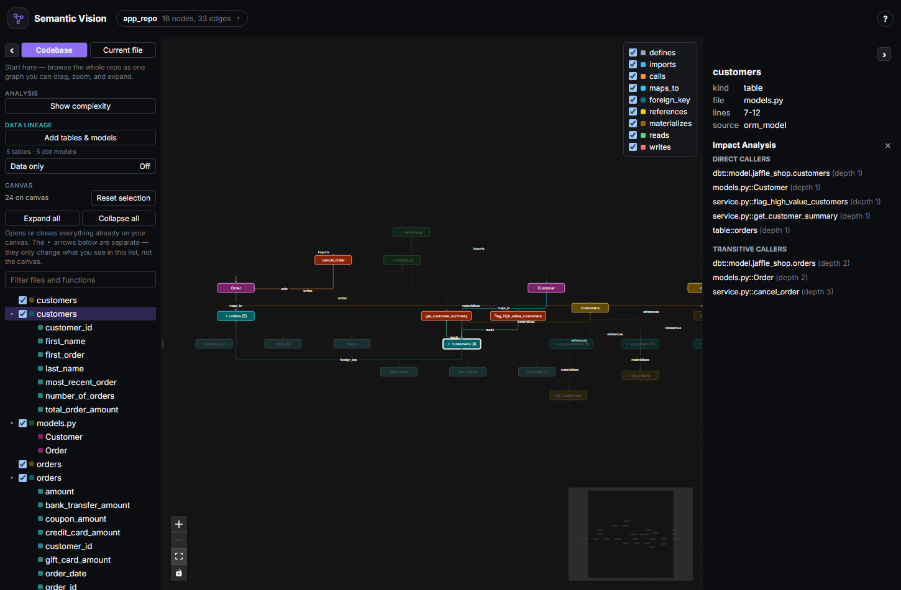

# Using code-to-data lineage

A walkthrough of the **Data lineage** sidebar section: connecting SQLAlchemy,
dbt, and a live database to one graph, reading it at the column level, and
using impact analysis to answer "what actually breaks if I change this"
before you change it. See the [main README](../README.md#code-to-data-lineage)
for the short version; this is the long one, with a real end-to-end example.

## What feeds the graph

Three independent sources, reconciled onto the same `Table`/`Column` nodes by
name — the same table only ever shows up once, no matter how many sources see
it:

- **SQLAlchemy models** — detected automatically on every parse, no setup.
  Every declarative model becomes a table with its columns underneath, every
  `ForeignKey` becomes an edge between tables, and every function that
  constructs, queries, or writes one is connected to it — down to the
  specific column, where it can be named with no guessing (a constructor's
  own keyword arguments, or a raw `INSERT`/`UPDATE`'s column list).
- **dbt** — click **Add tables & models** in the sidebar and point it at a
  `manifest.json` your own `dbt compile`/`dbt build` already produced.
  Semantic Vision never invokes dbt itself; it only reads what you hand it.
- **A live database** — same panel, a read-only connection string. Straight
  from the schema catalog, so it's the highest-confidence column source
  there is — useful for spotting where your ORM models have drifted from
  what's actually deployed.


## Connecting a dbt project

Click **Add tables & models**, paste the path to a `manifest.json`, click
**Ingest**. Below is a real dbt project — dbt Labs' own
[`jaffle_shop`](https://github.com/dbt-labs/jaffle_shop_duckdb) tutorial,
freshly built — ingested into a small Python app that already declares
`Customer`/`Order` SQLAlchemy models mapped to the same `customers`/`orders`
tables dbt builds:


The summary line (*"5 models ingested — 2 tables matched, 3 new — 21
columns"*) is the whole reconciliation story in one sentence: dbt's
`customers` and `orders` models landed on the **same** table nodes the
Python models already declared, not new, disconnected ones — and dbt's own
`schema.yml` columns (`first_order`, `number_of_orders`, `total_order_amount`,
…) were added alongside the columns the app already declared
(`customer_id`, `first_name`, `last_name`). One table, described by two
independent sources that agree on what it is.

## Reading the graph at the column level

Expand a table (click its **▸** chevron, same gesture as expanding a
directory or file) to see its columns as their own nodes, each with a
`DEFINES` edge from the table. A `reads`/`writes` edge lands on the specific
column when one can be named — otherwise it stays table-level, never
guessed at:



Right-click a column exactly like you would a table or a function — the
same context menu, the same actions:



## Impact analysis, at whichever granularity you need

Right-click a **table** and impact analysis crosses every source that
touches it — code, ORM, and dbt — in one traversal:



Right-click a **column** instead and the same traversal narrows to exactly
what touches *that* column — precise enough to tell apart a function that
reads the whole table from one that specifically depends on this one field:



That precision compounds when dbt is in the mix too. Right-clicking the
`customers` table from the jaffle_shop example above surfaces the dbt model
that materializes it, the ORM class mapped to it, and the functions that
read it — all as direct callers, one hop away:



That's the actual question a schema change needs answered — "does this dbt
model, this ORM class, or this specific function break if I touch this
column/table" — in one right-click, not four separate searches across a dbt
project, an ORM, and a codebase.

## The "Data only" filter

Once at least one table or dbt model is on the graph, a **Data only** toggle
appears in the same sidebar section (visible switched off, above, next to
the ingest summary). Flip it and everything that isn't a table, a dbt model,
or code directly reading/writing one dims out — the same graph, the same
impact analysis, just read as a pure lineage diagram instead of a full call
graph with some tables mixed in. It's a lens over the existing graph, not a
separate mode: right-click and impact analysis still cross into code exactly
as above, dimmed or not.

## Try it yourself

The jaffle_shop example above is fully reproducible — a few minutes, no
warehouse credentials needed (it targets DuckDB locally):

```bash
# 1. A tiny app with SQLAlchemy models matching jaffle_shop's real schema
mkdir app_repo && cd app_repo
cat > models.py <<'EOF'
from sqlalchemy.orm import declarative_base
from sqlalchemy import Column, Integer, String, Float, ForeignKey

Base = declarative_base()

class Customer(Base):
    __tablename__ = "customers"
    customer_id = Column(Integer, primary_key=True)
    first_name = Column(String)
    last_name = Column(String)

class Order(Base):
    __tablename__ = "orders"
    order_id = Column(Integer, primary_key=True)
    customer_id = Column(Integer, ForeignKey("customers.customer_id"))
    status = Column(String)
    amount = Column(Float)
EOF
cat > service.py <<'EOF'
from models import Customer, Order

def get_customer_summary(session, customer_id):
    return session.query(Customer).filter_by(customer_id=customer_id).first()

def flag_high_value_customers(cursor):
    cursor.execute(
        "SELECT customer_id, total_order_amount FROM customers "
        "WHERE total_order_amount > 1000"
    )

def cancel_order(session, order_id):
    order = Order(order_id=order_id, status="cancelled")
    session.add(order)
    return order
EOF
cd ..

# 2. A real dbt project, built locally (DuckDB, no live warehouse needed)
git clone https://github.com/dbt-labs/jaffle_shop_duckdb.git jaffle_shop
cd jaffle_shop
uv venv --python 3.13 .venv
uv pip install --python ./.venv/Scripts/python.exe -r requirements.txt
DBT_PROFILES_DIR=. ./.venv/Scripts/dbt.exe build   # 28/28 should pass
cd ..
```

Then in Semantic Vision: load `app_repo` as the repository, click **Add
tables & models**, and paste the path to
`jaffle_shop/target/manifest.json`.

## See also

- [Main README — Code-to-data lineage](../README.md#code-to-data-lineage)
  for the short version and the full feature list.
- [`benchmarks/superset.md`](../benchmarks/superset.md) — the same detection
  run against a large, real production codebase (Apache Superset: 37 tables,
  206 columns, 462 reads/writes edges), for scale rather than a worked
  example.
- [`docs/EDGE-KINDS.md`](../docs/EDGE-KINDS.md) — what every edge kind
  (`maps_to`, `foreign_key`, `references`, `materializes`, `reads`, `writes`)
  means and where it comes from, if you want the precise mechanics.
